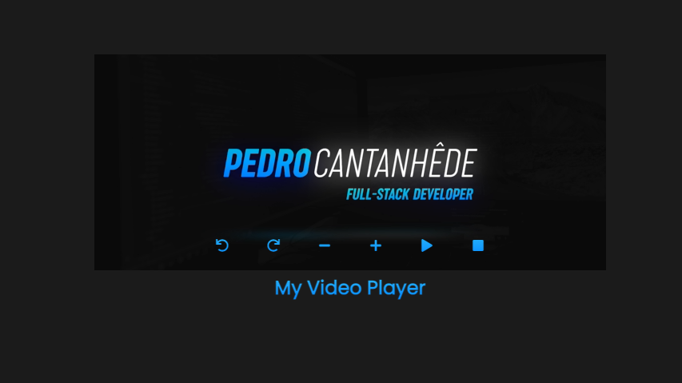
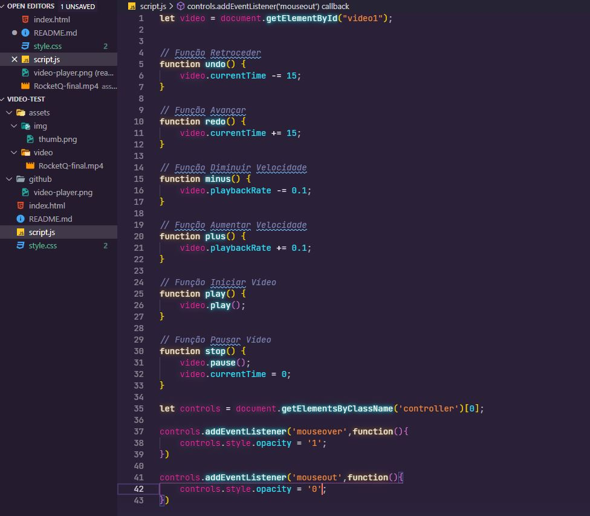

# ▶️ Player de Vídeo
Desafio realizado no curso Programador BR com o intuito de adquirir conhecimento em JavaScript. Nessa aula aprendemos a controlar um video utilizando a linguagem.

  

## :rocket: Com o que trabalhamos? 
✅ HTML

✅ CSS

✅ JavaScript

## Características do Player

✔ Função de Retroceder

✔ Função de Avançar

✔ Função de Diminuir Velocidade

✔ Função de Aumentar Velocidade

✔ Função de Iniciar

✔ Função de Reiniciar

## Código

